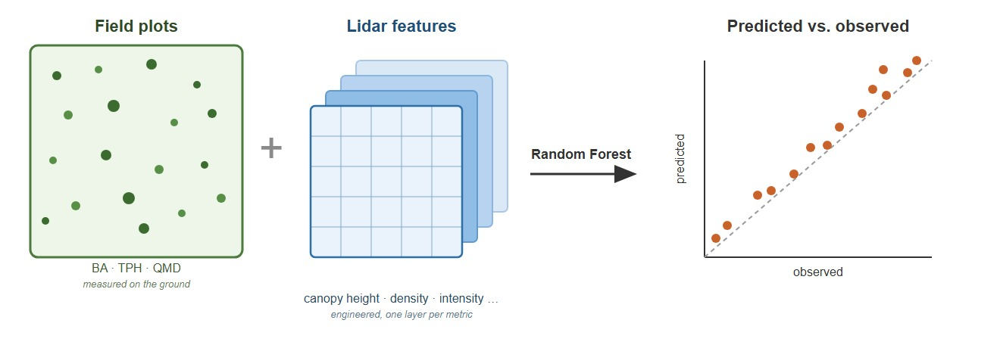
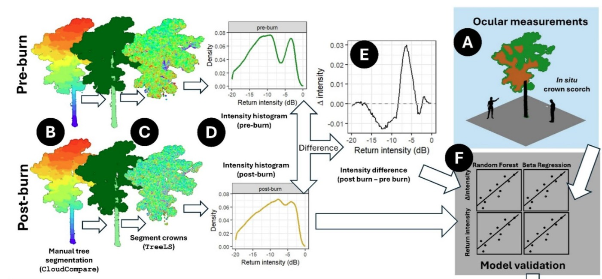
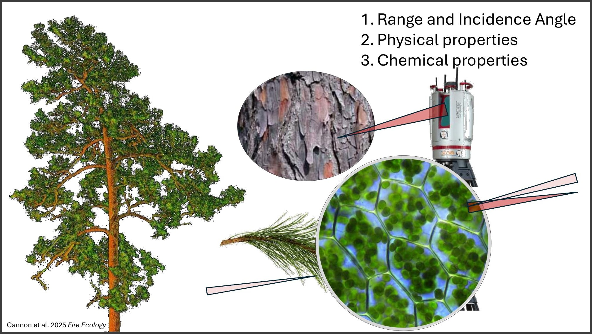
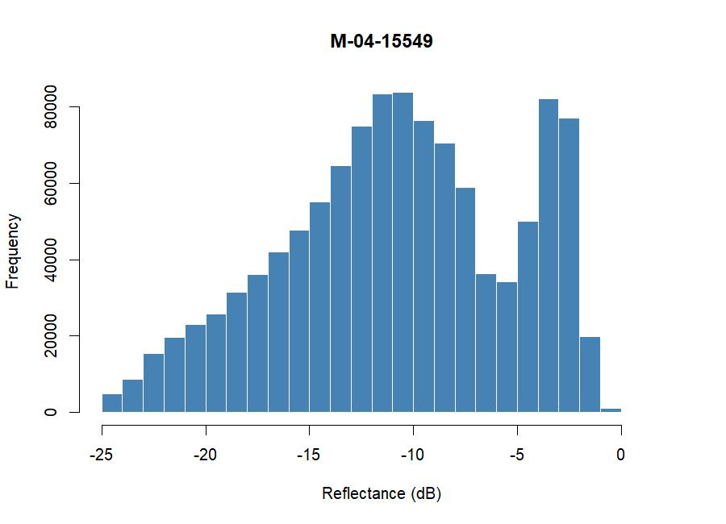
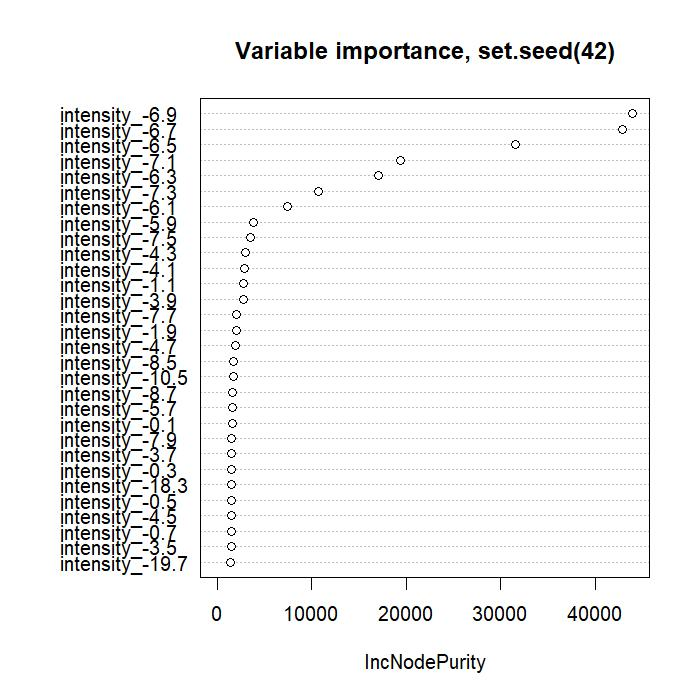
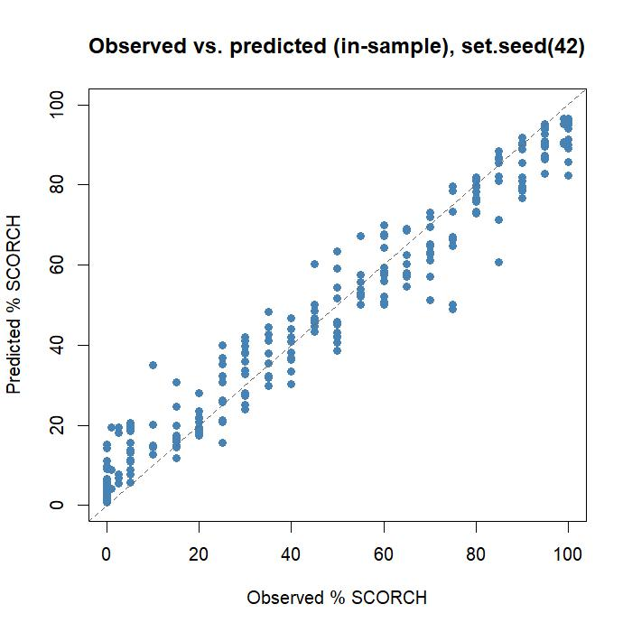

# codeblitz 5: Introduction to Machine Learning & Random Forests

The goal of `codeblitz5` is to introduce you to machine learning and random forests (RF). RF is one method of machine learning used for making predictions. In previous [codeblitz2](https://github.com/landeco-jonesctr/codeblitz2) you calculated forest structure measures, and in [codeblitz3](https://github.com/landeco-jonesctr/codeblitz3) and [codeblitz4](https://github.com/landeco-jonesctr/codeblitz4) you engineered features expected to predict them. Before linking them, we'll learn the general approach of making predictions from features using machine learning. with a different dataset, then we'll come back to the lidar features for homework.



> **Reminder (from [codeblitz3](https://github.com/landeco-jonesctr/codeblitz3)):** *features* are quantities we design for prediction, not measure directly. Features are often abstract, engineered, and correlated with each other, with no requirement that any single one has a clean ecological meaning on its own. They're valuable collectively, for the structure they capture together.

## Pre-work

It's helpful to understand what a random forest actually is. It has nothing to do with real forests. The reference "forests" comes from the fact that RF is built from from prediction trees, many of them, forming a "forest." The fact that we're applying it to forest data is a coincidence, not the origin of the name.

StatQuest offers some good visual explanations of how RF works. They are cheesy, yes. But are the best simple explanations I've found.

**Required review material**

1.  🪕🎵 [StatQuest: Decision Trees – Classification](https://www.youtube.com/watch?v=_L39rN6gz7Y) (18:08)
2.  🪕🎵 [StatQuest: Random Forests, Part 1](https://www.youtube.com/watch?v=J4Wdy0Wc_xQ) (9:54)
3.  🪕🎵 [StatQuest: Random Forests, Part 2](https://www.youtube.com/watch?v=sQ870aTKqiM) (11:53)

-   We'll use three main function from the `randomForest` package in R. Take a look at their help page for information:
    -   [`randomForest()`](https://cran.r-project.org/web/packages/randomForest/refman/randomForest.html#randomForest): fits the model.
    -   [`varImpPlot()`](https://cran.r-project.org/web/packages/randomForest/refman/randomForest.html#varImpPlot): plots which features mattered most.
    -   [`predict.randomForest()`](https://cran.r-project.org/web/packages/randomForest/refman/randomForest.html#predict.randomForest): applies a fitted model to new data.

> **Note:** The `randomForest` package, and most stats/ML documentation, calls the exact same thing a "variable." `varImpPlot()` above is a good example: it plots *variable* importance, not *feature* importance. Same concept, different field, different word. Expect both terms from here on.

**Optional material:**

- Additional videos
  -   🪕🎵 [StatQuest: Decision Trees – Feature Selection](https://www.youtube.com/watch?v=wpNl-JwwplA) (5:16)
  -   🪕🎵 [StatQuest: Regression Trees](https://www.youtube.com/watch?v=g9c66TUylZ4) (22:32)
  -   🪕🎵 [StatQuest: Random Forests in R](https://www.youtube.com/watch?v=6EXPYzbfLCE) (15:09)
- Additional articles
  -   Breiman, L. (2001). [Random Forests](readings/breiman_2001_random_forests.pdf). *Machine Learning* 45(1), 5–32. This is the original paper.
  -   Cannon, J.B., Zampieri, N.E., Whelan, A.W., Shearman, T.M., Sánchez Meador, A.J., & Varner, J.M. (2025). [Terrestrial lidar scanning provides efficient measurements of fire-caused crown scorch in longleaf pine](readings/cannon_2025_crown_scorch_fire_ecology.pdf). *Fire Ecology*, 21:71.
  -   Whelan, A.W., Cannon, J.B., Bigelow, S.W., Rutledge, B.T., & Sánchez Meador, A.J. (2023). [Improving generalized models of forest structure in complex forest types using area- and voxel-based approaches from lidar](readings/whelan_2023_lidar_forest_structure_models.pdf). *Remote Sensing of Environment*, 284, 113362.

All three PDFs are in [`readings/`](readings/).

## Practice: Predicting crown scorch from TLS intensity

Our example comes from a study on fire-caused crown scorch: Cannon, J.B., Zampieri, N.E., Whelan, A.W., Shearman, T.M., Sánchez Meador, A.J., & Varner, J.M. (2025). [Terrestrial lidar scanning provides efficient measurements of fire-caused crown scorch in longleaf pine](readings/cannon_2025_crown_scorch_fire_ecology.pdf). *Fire Ecology*, 21:71.



### Background

Field crews walked burned stands and visually estimated the percent of each tree's crown that was scorched by fire (0–100%). Terrestrial laser scanning (TLS) point clouds were also collected of each tree, and a histogram of point-cloud *intensity* (essentially, how reflective the foliage/bark surface was at each returned point) was built for every tree.

-   **Response variable:** `% SCORCH`, the field-estimated percent crown scorch, 0–100.
-   **Features:** bins of the intensity histogram for each tree (i.e., what fraction of a tree's points fell in each intensity range).

[](media/2026-Cannon-scorch-summary.pdf)

### Look at a raw scan

Six reference scans are included in [`data/laz/`](data/laz/).

```r
# one time setup
# lidR and CrownScorchTLS are off CRAN right now -- install from GitHub
#install.packages('devtools') #if you don't have it.
devtools::install_github("jbcannon/CrownScorchTLS") 
devtools::install_github("r-lidar/lidR")

library(CrownScorchTLS)
library(lidR)

las <- readLAS("data/laz/M-04-15549_post.laz")

plot(las)                        # raw point cloud
plot(las, color = "Intensity")   # colored by reflectance intensity

crown <- remove_stem(las)        # strip out the trunk, keep just the crown
crown <- add_reflectance(crown)  # fill in any missing reflectance values

hist(crown$Reflectance)          # just a plain base-R histogram, in dB, of the crown's points

hist_df <- get_histogram(crown)  # same idea, packaged as a one-row table

print(hist_df)
```

Output:

```
    intensity      density
1       -19.9 0.0240663301
2       -19.7 0.0234814341
3       -19.5 0.0235147208
4       -19.3 0.0247225548
5       -19.1 0.0262917880
6       -18.9 0.0289119318
7       -18.7 0.0288073162
8       -18.5 0.0297678771
...
```



Each tree's histogram becomes one row of predictor features once reshaped wide (one column per intensity bin), joined to that tree's `% SCORCH` value from the field survey.

I've already run this same pipeline on every tree in the study and assembled the results into one table: [`data/scorch_training_table.csv`](data/scorch_training_table.csv).

Work through the Analysis section below in pairs. If you're joining online, pair up with another remote participant so you can screen-share and work through it together.

Before you start: create your own branch, and create a file called `name_code.R` (with your own name) to write your code in as you work through the steps below.

### Step 1. Load and view the data

Read [`data/scorch_training_table.csv`](data/scorch_training_table.csv) into R and look at it:

- How many trees are there?
- How many feature columns are there?
- What's the response column called?

Relevant functions to look up: `read_csv()`, `nrow()`, `colnames()`.

### Step 2. Build a random forest model

Use the `randomForest` package to build a model predicting `% SCORCH` from the intensity features, using the *full* dataset. Save the output as the object `mod`.

> Before you call `randomForest()`, set a random seed with `set.seed()`. Pick your own number; it doesn't matter which one.

```r
set.seed(42)  # choose your own number here
mod <- randomForest(...)
```

Relevant function: `randomForest()`. You'll need to decide how to pass in your response and your predictors (there are two ways to call it: a formula, or `x =` / `y =` arguments).

### Step 3. Review the model output

Print the fitted model object and look at its summary output.

```r
print(mod)
```

- What percent variance is explained?
- **Discussion:** Does that match what your neighbor got? What if you change the seed? What if you match seed with someone else?

### Step 4. Plot observed vs. predicted

Make a scatterplot of observed vs. predicted `% SCORCH` using the model's OOB predictions.

```r
df$observed  <- df$scorch
df$predicted <- mod$predicted
```

It's also a good idea to add a 1:1 reference line to see where a perfect fit lies: see `abline()` in base R, or `geom_abline()` if you're using `ggplot`.

Here's what this looks like on the full 253-tree dataset (`set.seed(42)`).


### Step 5. Calculate error metrics

The scatterplot from step 4 shows you what your model's errors look like, but it's hard to compare models, feature sets, or results with a neighbor by eye alone. Error metrics boil that scatter down to a few numbers, so you can objectively say which model did better.

Add a column to your data called `error`, defined as:

$$\text{error} = \text{predicted} - \text{observed}$$

From that column (plus the observed and predicted values themselves), calculate the following. Look up the R functions you need: `mean()`, `sqrt()`, `abs()`, `cor()`, and basic arithmetic will get you all four.

-   **Bias (mean error):** $$\text{Bias} = \text{mean}(\text{predicted} - \text{observed})$$

-   **MAE (mean absolute error):** $$\text{MAE} = \text{mean}(\lvert \text{predicted} - \text{observed} \rvert)$$

-   **RMSE (root mean squared error):** $$\text{RMSE} = \sqrt{\text{mean}((\text{predicted} - \text{observed})^2)}$$

-   **R² (squared correlation between observed and predicted):** $$R^2 = \left(\text{cor}(\text{observed}, \text{predicted})\right)^2$$

### Step 6. Variable importance

Not every intensity bin is equally useful for predicting scorch; some carry a lot of signal, others are close to noise. `varImpPlot()` shows you which ones your model actually leaned on.

```r
varImpPlot(mod)
```

Here's what that looks like on the full 253-tree dataset (`set.seed(42)`):



**Discuss:**

- Do the most important bins cluster in a particular part of the intensity range?
- Does that match your intuition about what scorched vs. unscorched foliage should look like in a reflectance histogram?

### Step 7. Use the model to make a prediction

Now let's take the model and use it to make a prediction. Pretend you've just been handed a brand new set of trees whose scorch you don't actually know, and you want your model to predict it for you.

For now, we're going to cheat: instead of a truly new set of trees, we'll hand the model the exact same trees it was trained on and pretend they're "new" (steps 8-9 will do this properly).

Use `predict()` on your fitted model, applied to the *same* data you trained it on (not the OOB predictions from step 4):

```r
df$new_prediction <- predict(mod, newdata = ???)
```

Make a new plot of observed vs. this new prediction, the same way you did in step 4, and compare the two.

Here's what that looks like on the full 253-tree dataset, same model as step 4 (`set.seed(42)`):



**Discuss:** 

- Why does this plot look so much better than the one in step 4? 
- Is it a problem to predict on the same data you trained with? 
- What is OOB error, and how does it get around this issue?

### Step 8. Split into training and validation data

Steps 4 and 7 showed why: the honest way to evaluate a model is on data it has never seen. Split your data into `training` and `validation` sets that are truly independent of each other.

Figure out a way to randomly assign \~75% of rows to a `training` dataset and the remaining \~25% to a `validation` dataset.

Relevant functions to look up: `sample()` (or `nrow()` + `sample()` together). Set a random seed (`set.seed()`) so your split is reproducible.

### Step 9. Train and validate

Train a new random forest using *only* the training data. Then use `predict()` to apply that model to the validation data it has never seen. Plot observed vs. predicted for the validation set, and recalculate your four error metrics from step 5.

**Discuss:**

- How do these numbers compare to steps 4 and 7?
- Which one is the honest estimate of how this model will perform on a brand-new tree?

Before you move on to homework, be sure to commit, push, and update your branch.

## Homework

For homework, we'll prepare to apply everything above to the features we engineered in [codeblitz3](https://github.com/landeco-jonesctr/codeblitz3)/[codeblitz4](https://github.com/landeco-jonesctr/codeblitz4) and the plot-level metrics from [codeblitz2](https://github.com/landeco-jonesctr/codeblitz2).

**Assemble your dataset:**

1.  Create your own branch (or keep working in the one you made above), and create a file called `name_homework.R` (with your own name) to work in.
2.  Extract BA, density, and QMD from all LTM (long-term monitoring) plots in your assigned year.
3.  Extract all engineered features from your lidar dataset for those same plots. Hint: use the function `terra::extract()`.
4.  Combine both into a single dataframe. Work with your team to make sure ID/name formats match across tables (plot IDs, year, etc. all need to line up before they can be joined); this is usually the hardest part, not the modeling.
5. Bonus: Experiment with a test run using `randomForest()` on your assigned year. Which variables seem to matter most? What R², RMSE, MAE, and bias do you get?

Next session, we'll combine everyone's tables across years and run the full model together.

------------------------------------------------------------------------

*Concept, examples, and flow conceptualized by JBC; assistance with compilation and drafting, and editing from Claude Sonnet 5.*
